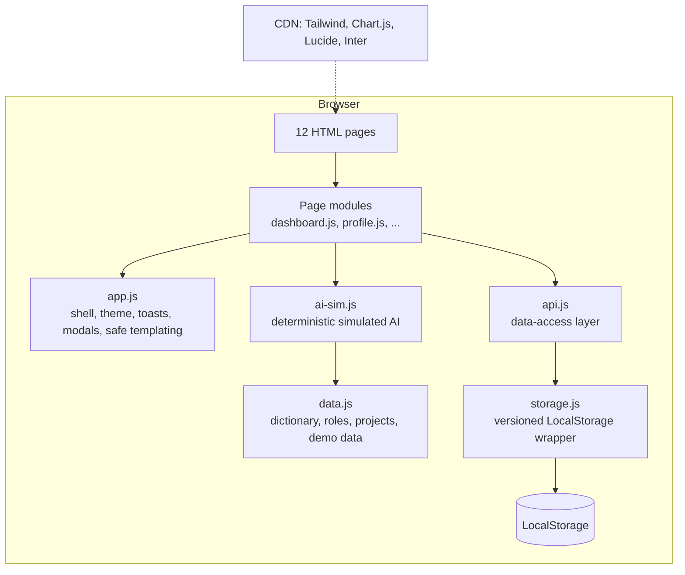
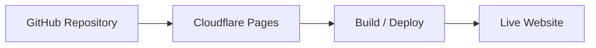

<div align="center">

# 🚀 CareerPilot AI

### AI-Powered Career & Skill Intelligence Platform

> Know your skills, see your gaps, follow a plan and track every application: one AI-inspired career intelligence interface.

<p>
  
  
  
  
  
  
  
</p>

**[🌐 Live Demo](YOUR_LIVE_DEMO_URL)** &nbsp;·&nbsp; **[📂 View Source](https://github.com/Majortarif/CareerPilot-AI-AI-Powered-Career-Skill-Intelligence-Platform)**

</div>

---

## ✨ Product Preview

<!-- Add product preview GIF here: frontend/assets/careerpilot-preview.gif -->

_Preview GIF coming soon._ Expected asset layout:

```text
frontend/assets/
├── favicon.svg                  # exists
├── careerpilot-preview.gif      # to be added
└── screenshots/                 # to be added
    ├── landing.png
    ├── dashboard.png
    ├── skill-gap.png
    └── applications.png
```

---

## About the Project

Early-career job seekers juggle the same questions over and over:

- **Which skills do I actually have**, and how strong are they?
- **Which skills am I missing** for the jobs I want?
- **What do job descriptions really require**, and what is only "nice to have"?
- **What should I learn next**, and in what order?
- **Which portfolio projects** would prove those skills?
- **Where did I apply**, and what is the status of each application?
- **Am I making progress** week to week?

CareerPilot AI answers these in one connected workspace. A single career profile feeds the CV analyzer, job analyzer, skill-gap view, learning roadmap, project recommendations, application tracker and analytics.

This repository contains **Stage A: a frontend prototype**. There is no backend, no database, no real authentication and no external AI API. The AI experience is **simulated** with deterministic, rule-based logic, and all data lives in the browser's LocalStorage. The project is designed for future full-stack expansion.

---

## Core User Flow

The intended product experience (every step is clickable in the prototype):

```mermaid
flowchart LR
    A[Career Profile] --> B[CV Upload]
    B --> C[CV Analysis]
    C --> D[Skill Extraction]
    D --> E[Target Job]
    E --> F[Job Description Analysis]
    F --> G[Skill Gap]
    G --> H[Learning Roadmap]
    H --> I[Project Recommendations]
    I --> J[Application Tracking]
    J --> K[Career Analytics]
```



---

## Features

| Feature | What it does | Page |
|---|---|---|
| **Career Profile** | Personal details, target role, summary, education entries, links, and a skills editor with 0–100 levels | `profile.html` |
| **CV Analyzer** | Drag & drop PDF (metadata only) or paste text → detected skills, strengths, suggestions, missing sections, keywords, prototype score | `cv-analyzer.html` |
| **Job Analyzer** | Title + company + description → required vs preferred skills, technologies, responsibilities, experience years, seniority; save as target | `job-analyzer.html` |
| **Skill Gap** | 🟢 Strong / 🟡 Partial / 🔴 Missing table, compatibility ring, inline level updates | `skill-gap.html` |
| **Skill Intelligence** | 140-skill dictionary across 7 categories with aliases (C++, Node.js, CI/CD…), plus 10 role profiles | `js/data.js` |
| **Career Roadmap** | 8, 12 or 16-week plan with objective, practice, mini project and hours; completion tracking | `roadmap.html` |
| **Project Recommendations** | 26 curated portfolio projects ranked by gap overlap and target role; 5 filters | `projects.html` |
| **Application Tracker** | CRUD over 7 statuses, search, status filter, 4 sort orders, table and drag-and-drop board | `applications.html` |
| **Analytics** | 5 charts with demo vs your-data labels | `analytics.html` |
| **AI Assistant** | Rule-based chat that answers with your saved data, with suggestion chips and typing animation | `assistant.html` |
| **Settings** | Theme, motion preference, demo data toggle, JSON export/import, reset, engine self-test | `settings.html` |

---

## 🤖 AI Experience

CareerPilot AI uses a **frontend AI simulation layer** (`frontend/js/ai-sim.js`):

- **No LLM API and no ML model.** Nothing is sent to any server.
- **Deterministic logic.** The same input always gives the same output, checked by a 20-case self-test (`js/ai-sim.test.js`, also runnable from Settings).
- **Structured demo data.** A skill dictionary, role profiles, sample CV, sample job posts and curated projects (`js/data.js`).
- **Rule-based recommendations.** Keyword and alias matching, cue-word classification ("must", "nice to have"), weighted scores and templates.
- **Simulated states.** Scanning and typing animations make the flow feel like a product without pretending to be real inference.

> **Prototype Notice:** AI analysis shown in the current version is simulated and should not be interpreted as real machine-learning or LLM inference.

| Function | Approach |
|---|---|
| `extractSkills(text)` | Longest-match-first dictionary matching with word-boundary-safe regexes; case-sensitive matching for short names (C, R, Go) |
| `analyzeCV(input)` | Section detection, contact/link checks, quantified-impact and action-verb counts → score, strengths, suggestions |
| `analyzeJob(job)` | Section headings and cue words decide required vs preferred; bullet lines become responsibilities; regex for years of experience |
| `computeSkillGap(user, job)` | Thresholds 70 / 30 and `(0.7 × required + 0.3 × preferred) × 100` |
| `buildRoadmap(gaps, weeks)` | Importance ordering, week allocation by phase (Foundations → Applied practice → Build & ship), capstone/interview/review weeks |
| `recommendProjects(role, gaps)` | Score = 2 × gap overlap (missing 2, partial 1) + 3 for a role match |
| `assistantReply(msg, ctx)` | Keyword intent scoring and templates filled with the user's data |

---

## Dashboard

- **Career Readiness** ring (prototype metric: 40% job compatibility, 20% profile completion, 20% learning progress, 20% average skill level, re-weighted when no job is set)
- KPIs with count-up: **Profile Completion, Skills Identified, Skill Gaps, Applications, Interviews, Learning Progress**
- **3 charts:** skill profile radar, application pipeline, learning-hours doughnut
- **Recent activity** timeline built from real record timestamps, plus rule-based **next steps**

## CV Analyzer

- Drag & drop zone with validation (PDF only, max 10 MB, empty files rejected) and keyboard access
- **Paste text** mode for a personalised analysis, or **try the sample CV**
- Five-step scanning animation → score ring, detected skills by category, strengths, suggestions, missing information and top keywords
- One click adds new skills to the profile with estimated levels

> **Simulated. No document is uploaded to any server.** The prototype reads only a PDF's name and size, then analyzes a built-in sample CV profile. Pasted text is analyzed in the browser.

## Job Description Analyzer

- Required fields with inline errors; three built-in sample posts
- Output: required and preferred skills (coloured by your level), technologies, soft skills, responsibilities, keywords, seniority and experience years
- Quick-match ring, then **save & set as target**. Saved jobs can be viewed, activated or deleted.

> Simulated analysis based on a skill dictionary, section headings and cue words.

## Skill Gap Intelligence

| Status | Rule | Score |
|---|---|---|
| 🟢 Strong | level ≥ 70 | 1 |
| 🟡 Partial | 30 ≤ level < 70 | 0.5 |
| 🔴 Missing | not in profile or level < 30 | 0 |

**Compatibility = (0.7 × requiredScore + 0.3 × preferredScore) × 100**

Example:

| Skill | Type | Your level | Status | Score |
|---|---|---|---|---|
| Python | Required | 82 | 🟢 Strong | 1 |
| SQL | Required | 62 | 🟡 Partial | 0.5 |
| Docker | Required | 22 | 🔴 Missing | 0 |
| AWS | Preferred | — | 🔴 Missing | 0 |
| Git | Preferred | 72 | 🟢 Strong | 1 |

requiredScore = (1 + 0.5 + 0) / 3 = 0.5 · preferredScore = (0 + 1) / 2 = 0.5 → **compatibility = 50%**

> Prototype compatibility score. Not a hiring probability.

## Career Roadmap

- Generated from the active job's gaps: **12 weeks** by default (8 or 16 also available)
- Every item has **week, skill, phase, objective, practice, mini project, hours** and a **done** flag
- Missing required skills come first. Spare weeks become a capstone project, interview preparation and a review week.
- Animated overall progress (weighted by hours), per-week completion states and filters. Progress is saved in LocalStorage.

## Project Recommendations

- 26 curated ideas across **AI/ML, Data, Web, Full Stack, Analytics**
- Filters: search, category, difficulty, technology, learning objective
- Ranked by overlap with your gaps and target role, labelled Top match / Good match / Explore, with a milestone plan per project

## Application Tracker

- **7 statuses:** Saved, Applied, Screening, Interview, Offer, Rejected, Withdrawn
- **CRUD** with validation, status history and job-posting links
- **Search**, **status filter**, **sort** (recently updated, applied date, company, pipeline stage)
- **Table view** (stacked cards on phones) and **board view** with drag & drop plus an accessible "Move to" menu

## Analytics

Five theme-aware Chart.js charts:

1. Applications over time (weekly + cumulative)
2. Status distribution
3. Interview conversion funnel
4. Skill distribution by category and level band
5. Learning progress per roadmap week

Every chart is labelled **Demo data**, **Your data** or **Mixed**, based on each record's `demo` flag.

## UI / UX

- Dark theme by default, with a light theme; tokens in CSS variables and no flash on load
- Responsive app shell: sidebar on desktop, drawer + bottom navigation on mobile
- Shared components: cards, buttons, inputs, badges, tables, modals, toasts, skeletons, empty and error states
- Data-driven pages show skeleton loading states and helpful empty states; every app page has an error state with retry

## Animation & Interaction System

- Page entrance, scroll reveal (IntersectionObserver), staggered cards
- KPI count-up, animated progress bars and score rings, Chart.js draw-in
- CV scanning animation, assistant typing indicator, message transitions
- Hover lift, tooltips, toast and modal transitions, roadmap completion pop
- All motion is disabled under `prefers-reduced-motion` or the in-app "Reduced" setting

---

## Tech Stack

| Layer | Technology |
|---|---|
| Markup | HTML5 (12 semantic pages) |
| Styling | Tailwind CSS (Play CDN) + `css/style.css` design tokens and components |
| Logic | Vanilla JavaScript (ES modules, no framework, no build step) |
| Charts | Chart.js 4 (CDN) |
| Icons | Lucide (CDN) |
| Font | Inter (Google Fonts) |
| Storage | Browser LocalStorage (`cp:v1:*` keys) |
| Serving | nginx 1.27 (Docker) or any static host |

## Frontend Architecture

**There is no backend layer.** Everything runs in the browser.



- Pages talk to `api.*` only. `api.js` is the single place to swap LocalStorage for a REST API later.
- User text is escaped by an `html` tagged template before it reaches the DOM.

## LocalStorage Architecture

| Key | Content |
|---|---|
| `cp:v1:profile` | name, headline, target role, experience level, summary, education, links, last CV summary |
| `cp:v1:skills` | `[{ id, name, level 0–100, category }]` |
| `cp:v1:applications` | application records with status history |
| `cp:v1:savedJobs` | analyzed job descriptions |
| `cp:v1:roadmap` | roadmap items and completion |
| `cp:v1:assistant` | chat history (latest 100 messages) |
| `cp:v1:theme` | `dark` \| `light` |
| `cp:v1:settings` | active job, motion preference, tracker view |
| `cp:v1:demo` | `true` while demo data is active |

- Every read and write is wrapped in try/catch; corrupted values fall back to safe defaults.
- Demo records carry `demo: true`, so they can be removed without touching your own records.
- **LocalStorage is not secure storage.** It is unencrypted, per-browser and readable by any script on the origin. Do not store sensitive personal data.

## Project Structure

```text
CareerPilot-AI-AI-Powered-Career-Skill-Intelligence-Platform/
├── CLAUDE.md
├── README.md
├── PROJECT_REPORT.md
├── LICENSE
├── .gitignore
├── .dockerignore
├── docker-compose.yml
└── frontend/
    ├── Dockerfile
    ├── nginx.conf
    ├── .dockerignore
    ├── index.html
    ├── dashboard.html
    ├── profile.html
    ├── cv-analyzer.html
    ├── job-analyzer.html
    ├── skill-gap.html
    ├── roadmap.html
    ├── projects.html
    ├── applications.html
    ├── analytics.html
    ├── assistant.html
    ├── settings.html
    ├── css/
    │   └── style.css
    ├── js/
    │   ├── theme-init.js      # pre-paint theme + Tailwind config
    │   ├── app.js             # shell, nav, theme, toasts, modals
    │   ├── storage.js         # LocalStorage wrapper (versioned keys)
    │   ├── api.js             # data-access layer
    │   ├── data.js            # skill dictionary, roles, projects, demo data
    │   ├── ai-sim.js          # deterministic "AI" simulation
    │   ├── ai-sim.test.js     # determinism self-test
    │   ├── dashboard.js
    │   ├── profile.js
    │   ├── cv-analyzer.js
    │   ├── job-analyzer.js
    │   ├── skill-gap.js
    │   ├── roadmap.js
    │   ├── projects.js
    │   ├── applications.js
    │   ├── analytics.js
    │   ├── assistant.js
    │   └── settings.js
    └── assets/
        └── favicon.svg
```

## Responsiveness

- Tested at **360, 768, 1024, 1440 and 1920 px** with no horizontal page overflow
- Sidebar at ≥ 1024 px; drawer + 5-item bottom navigation below
- Tables become stacked cards under 720 px; the board scrolls inside its own container
- Touch targets are at least 44 px on coarse pointers

## Accessibility

- Skip link, semantic landmarks, one `h1` per page, labelled form fields with `aria-describedby` errors and focus on the first invalid field
- Visible `:focus-visible` outlines; focus-trapped modals and drawer with Esc to close and focus restore
- ARIA: tabs, radio groups, `aria-pressed` toggles, `aria-live` regions for toasts, chat and saves, `role="img"` summaries on charts and rings
- Keyboard alternatives for drag & drop (a "Move to" select) and file upload
- Reduced-motion support (system and in-app)

---

## Installation

```bash
git clone https://github.com/Majortarif/CareerPilot-AI-AI-Powered-Career-Skill-Intelligence-Platform.git
cd CareerPilot-AI-AI-Powered-Career-Skill-Intelligence-Platform/frontend
python -m http.server 8000
# open http://localhost:8000
```

> ES modules need an HTTP server; opening the files via `file://` will not work. An internet connection is needed for the CDN assets (Tailwind, Chart.js, Lucide, Inter).

**Docker option (Stage A, `web` service only):**

```bash
docker compose up --build -d
# open http://localhost:8080  (health check: http://localhost:8080/healthz)
docker compose logs -f web
docker compose down
```

## Deployment

**Recommended: Cloudflare Pages**



| Setting | Value |
|---|---|
| Build command | _(none)_ |
| Output directory | `frontend` |

Also works on **Netlify**, **GitHub Pages**, **Vercel (static)** or **Docker/nginx** on a VPS (put an HTTPS reverse proxy such as Caddy or nginx + Certbot in front of port 8080).

Live URL: `YOUR_LIVE_DEMO_URL` (not deployed yet).

## Limitations

These are intentional limits of a frontend prototype:

- No backend or REST API
- No PostgreSQL or any server database
- No real authentication or user accounts
- No real AI API (LLM or ML model); analysis is rule-based
- No server-side PDF processing (PDF contents are not read)
- No cloud database or real-time sync between devices
- No multi-user data isolation
- No secure document storage (LocalStorage is unencrypted)
- Tailwind runs from the Play CDN, which is not intended for production builds

## Future Roadmap

**Phase 1: Frontend prototype ✅**

- ✅ Frontend prototype (12 pages)
- ✅ Responsive UI with dark/light themes
- ✅ LocalStorage persistence with export/import/reset
- ✅ Simulated AI (deterministic, self-tested)
- ✅ Analytics dashboards
- ✅ Application tracking

**Phase 2: Full-stack ⬜**

- ⬜ Backend APIs (planned: FastAPI + PostgreSQL 16 via Docker Compose)
- ⬜ PostgreSQL persistence
- ⬜ Authentication (JWT) and multi-user isolation
- ⬜ Secure CV storage and real PDF processing
- ⬜ Real AI/LLM integration
- ⬜ Next.js frontend and Supabase (options under evaluation)
- ⬜ Cloud deployment

## What I Learned

- Designing a **data-access layer** (`api.js`) so a storage backend can be swapped without touching pages
- Building **deterministic "AI" logic** that is explainable, testable and honest about its limits
- Word-boundary-safe **text matching** for tricky tokens like `C++`, `C#`, `Node.js` and `CI/CD`
- A small **design system** with CSS variables, theming without flash, and accessible components
- **Accessibility** details: focus management, ARIA live regions, keyboard alternatives to drag & drop
- **Motion design** that respects `prefers-reduced-motion`
- Containerizing a static site with **nginx**, security headers and a health check

## Testing Checklist

Checked in a Chromium-based browser during development. Docker items could not be run in the build environment, so they still need to be verified.

- [x] Navigation (all pages, active state, mobile menu)
- [x] Responsive layout (360 / 768 / 1440 / 1920)
- [x] Theme switching + persistence
- [x] Profile editing
- [x] LocalStorage persistence (reload, export/import, reset)
- [x] CV analyzer interaction (drag & drop, invalid file type, processing animation)
- [x] Job analyzer interaction (empty input error, valid input)
- [x] Skill gap calculation (deterministic, correct statuses)
- [x] Roadmap progress
- [x] Application CRUD
- [x] Search / filter / sort
- [x] Analytics charts (render, theme colors, demo label)
- [x] AI assistant
- [x] Mobile layout (no horizontal overflow, touch targets ≥ 44px)
- [x] Empty states
- [x] Error states
- [x] Keyboard navigation and focus visibility
- [x] `prefers-reduced-motion` respected
- [ ] `docker compose up --build` works from a clean clone
- [ ] Container healthcheck passes

## Screenshot Gallery

| Landing | Dashboard |
|---|---|
| _Add `frontend/assets/screenshots/landing.png`_ | _Add `frontend/assets/screenshots/dashboard.png`_ |

| Skill Gap | Applications |
|---|---|
| _Add `frontend/assets/screenshots/skill-gap.png`_ | _Add `frontend/assets/screenshots/applications.png`_ |

## 🌐 Live Demo

[🚀 Open CareerPilot AI](YOUR_LIVE_DEMO_URL)

## Author

**Tariful Hoque**: CSE Graduate | Machine Learning & AI | Data Science | UI/UX

Email: tarifulhoque347@gmail.com · LinkedIn: https://www.linkedin.com/in/tariful-hoque-582321259 · Portfolio: https://tarifulhoqueportfoloi.netlify.app/ · GitHub: https://github.com/Majortarif

## License

This project is created for educational, portfolio, and demonstration purposes. © 2026 Tariful Hoque
